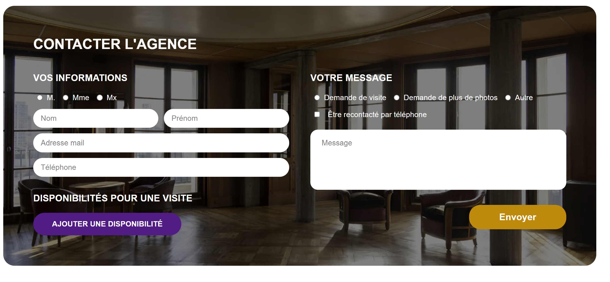
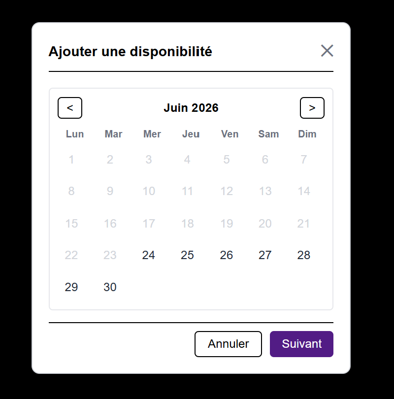
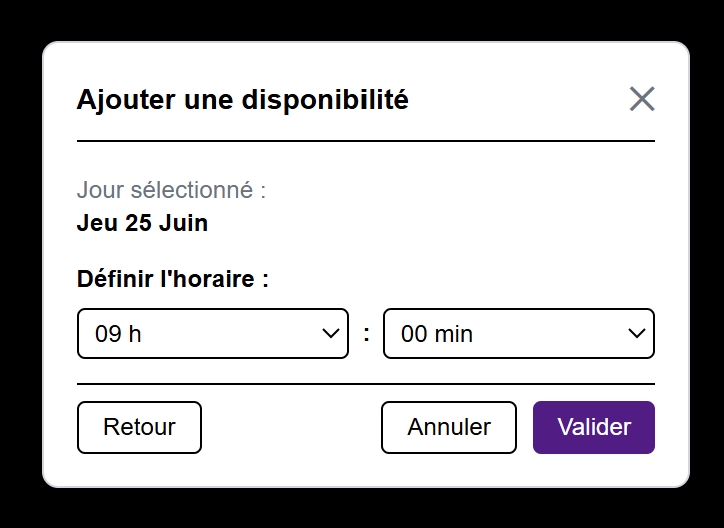
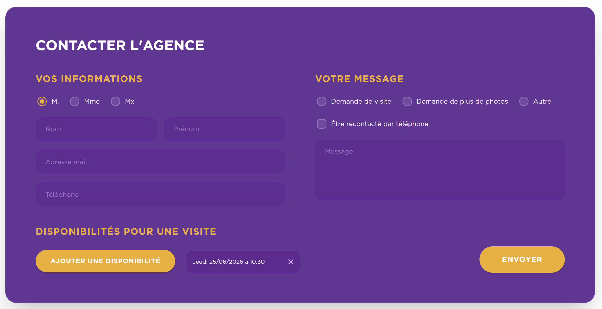
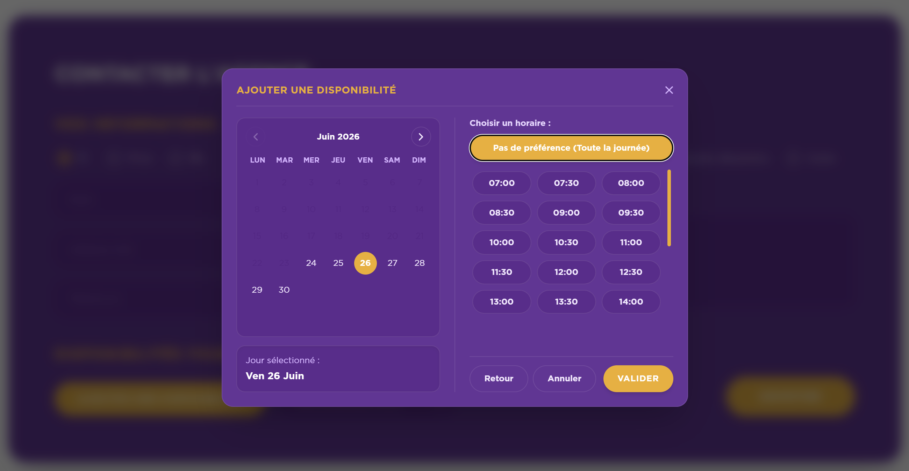

# 🏠 Test Technique - Formulaire de Contact Majordhom

## 👤 Informations Candidat
* **Nom** : Monossian
* **Prénom** : Haïk
* **Niveau d'études** : Bac +1
* **Contrat recherché** : Alternance (2 ans)

### 🔗 Liens & Contacts
* 💼 **LinkedIn** : [Haik Monossian](https://www.linkedin.com/in/haik-monossian-523b11351/)
* 🌐 **Portfolio** : [portfolio.hykoo.fr](https://portfolio.hykoo.fr/)
* 💻 **GitHub Personnel** : [Hykoo13](https://github.com/Hykoo13)
* 🎓 **GitHub Scolaire** : [haik-monossian](https://github.com/haik-monossian)

---

## ⚙️ Comment je procède

1. **Prise en main et initialisation** : Je commence par lire attentivement la consigne, puis j'initialise mon dépôt Git afin de créer le fichier README et d'y renseigner directement les premières informations demandées.
2. **Analyse du besoin** : Habituellement, je réalise une maquette sur Figma. Cependant, comme une maquette d'exemple était fournie pour cet exercice, je me suis basé dessus pour cibler au mieux le besoin client.
3. **Mise en place du projet** : Je crée une nouvelle branche Git pour la fonctionnalité et j'installe Next.js.
   * *Pourquoi Next.js ?* C'est un framework complet qui intègre d'office Tailwind CSS et TypeScript, ce qui permet d'accélérer le développement et de réduire les erreurs d'inattention. Bien qu'il soit plus lourd qu'un projet React pur, il offre une flexibilité incomparable.
   * *Pourquoi la version la plus récente (v16.2.9) ?* C'est toujours une bonne pratique de partir sur la version la plus récente afin de profiter des derniers correctifs de bugs ou de failles de sécurité, même si cela ne garantit jamais l'absence totale de nouvelles anomalies.
4. **Base de données et persistance** : Une fois la base du frontend terminée, je passe à l'intégration de la base de données. J'ai choisi d'utiliser **SQLite avec Prisma** : c'est très léger, local et idéal pour ce type de projet. De plus, avec Prisma, la transition vers une base de données de production comme PostgreSQL se fait très simplement et sans réécriture de code.
5. **Amélioration continue (V2)** : Ayant fini le projet assez rapidement, j'ai visité le site officiel de Majordhom pour m'imprégner de sa charte graphique et de sa direction artistique (DA). Comme il me restait du temps, j'ai décidé de créer une deuxième version (V2) plus moderne, épurée et alignée avec l'identité de la marque, en m'éloignant de la maquette d'origine pour proposer une expérience utilisateur supérieure.

---

## 📸 Comparaison Visuelle (V1 vs V2)

### 📌 Version 1 (V1)
Voici les captures d'écran de la version initiale (V1) :

#### Formulaire Principal (V1)


#### Modale de sélection de date/heure (V1)
L'ancienne modale de sélection de disponibilité en deux étapes avec sélecteurs déroulants :
* **Étape 1 : Choix de la date**
  
* **Étape 2 : Choix de l'heure et des minutes**
  

---

### 🚀 Version 2 (V2 - Améliorée)
Voici les captures d'écran de la version optimisée (V2) :

#### Formulaire Principal (V2)
Formulaire compact avec typographie de marque hybride et animations fluides.


#### Modale de sélection (V2)
Modale interactive en une seule étape, avec grille de créneaux de 30 minutes style Calendly/Doctolib.


---

## 🛠️ Stack Technique

### 💻 Framework
* **Next.js (v16.2.9) / React (v19.2.4)** : J'ai choisi d'utiliser Next.js car l'App Router et les Server Actions sont super pratiques pour lier le formulaire à la base de données sans avoir à créer une API séparée.

### 🧰 Outils & Librairies Principales
* **Tailwind CSS (v4)** : Pour intégrer rapidement le style et les couleurs de l'agence tout en gérant facilement les animations (boutons, modale, toasts).
* **Prisma (v7.8.0)** : Pour modéliser la base de données et faire des requêtes propres sans écrire de SQL brut.
* **SQLite (better-sqlite3 v12.11.1)** : Une base de données locale légère et rapide, parfaite pour stocker les contacts et leurs créneaux pour un projet test de démonstration.
* **API Date JavaScript (Native)** : Je n'ai pas installé de librairie externe de dates (type date-fns ou moment) ; j'ai tout codé en JS natif pour créer le calendrier interactif.
* **TypeScript (v5)** : Pour typer proprement le projet et éviter les bugs d'inattention.

---

## 🚀 Lancement du projet en local

### ⚡ Méthode rapide avec un script auto (Windows)
Double-cliquez simplement sur le fichier **`start.bat`** à la racine du projet. Ce script s'occupe d'installer les dépendances (`npm install`), de préparer la base de données SQLite avec Prisma, et de lancer le serveur local.

---

### 🛠️ Méthode manuelle

1. **Installer les dépendances** :
   ```bash
   npm install
   ```

2. **Préparer la base de données (SQLite & Prisma)** :
   Génère le client Prisma et configure la base de données locale `dev.db` :
   ```bash
   npx prisma generate
   npx prisma db push
   ```

3. **Lancer le serveur de développement** :
   ```bash
   npm run dev
   ```
   Rendez-vous ensuite sur [http://localhost:3000](http://localhost:3000) !

4. **Visualiser les données (Facultatif)** :
   Si vous souhaitez inspecter les contacts et les créneaux enregistrés en base de données, vous pouvez lancer l'interface d'administration :
   ```bash
   npx prisma studio
   ```

---

> [!TIP]
> **Pour voir la version d'origine (V1) :**
> Si vous souhaitez tester la version 1 en local et voir la différence, vous pouvez basculer sur sa branche dédiée et lancer manuellement avec le guide au dessus :
> ```bash
> git checkout feat/form
> ```

---

## 💬 Réponses aux questions

### 1. Avez-vous trouvé l’exercice facile ou difficile ? Qu’est-ce qui vous a posé problème ?
J'ai trouvé l'exercice assez simple dans l'ensemble, et je n'ai pas rencontré de problème particulier lors du développement.

### 2. Avez-vous appris de nouveaux outils pour répondre à l’exercice ? Si oui, lesquels ?
Oui, j'ai découvert de nouvelles balises HTML pour les formulaires. Concernant Prisma, c'est un outil que je connaissais déjà mais que je n'avais encore jamais manipulé sur un projet concret.

### 3. Quelle est la place du développement web dans votre cursus de formation ?
Dans ma formation, j'ai choisi la spécialité logiciel, mais on fait du web la moitié du temps car les deux domaines sont très mélangés et complémentaires aujourd'hui. L'année prochaine, les formations web et logiciel vont fusionner dans mon école car on y voit pratiquement les mêmes concepts.

### 4. Avez-vous utilisé un LLM ? Si oui, comment intégrez-vous les LLM à chaque étape de votre workflow ?
Oui, j'utilise Gemini Flash car il consomme peu de tokens, répond très vite à mes questions et m'aide beaucoup pour chercher de la documentation ou faire des tests de code. Généralement, je m'en sers pour remettre en question mes choix techniques (quelle stack est la plus optimale selon plusieurs critères) et discuter de choix de design et d'ergonomie. C'est un outil fabuleux pour explorer des idées et faire le pont entre ce que l'on imagine et ce qui est réellement agréable à utiliser. J'ai une préférence pour Claude que j'utilisais avant mais je trouve que Gemini se débrouille assez bien pour quelque chose que je ne paye pas. La où Claude est payant mais fournit un travail plus précis (parfois trop précis). Du côté de GPT avec Codex, je ne suis pas un très grand utilisateur de gpt je l'ai très souvent trouvé en dessous de la concurrence malgrès le fait que j'entends du bien de leur cli codex.

---

## 📈 Pistes d'améliorations futures

Si je devais pousser le projet plus loin, voici ce que j'ajouterais :

* **Tableau de bord administrateur (Dashboard)** : Créer un espace sécurisé (avec authentification via Auth.js / NextAuth) pour permettre aux agents de visualiser, filtrer et gérer les demandes reçues et les créneaux réservés.
* **Confirmation automatique par mail** : Intégrer un service d'envoi de mails (comme Resend ou Nodemailer) pour notifier automatiquement l'administrateur d'une nouvelle demande et envoyer un e-mail de confirmation au prospect.
* **Synchronisation avec des calendriers externes** : Permettre l'exportation des rendez-vous vers Google Calendar ou Outlook (avec génération de fichiers `.ics`).
* **Gestion des conflits en temps réel (côté serveur)** : Ajouter une vérification en base de données pour bloquer la réservation simultanée d'un même créneau par deux utilisateurs différents.

---

## ✉️ Remerciements
Merci beaucoup pour ce test ! J'ai vraiment apprécié travailler sur cet exercice.

En m'intéressant à votre agence Majordhom, j'ai beaucoup accroché avec le secteur de l'immobilier. J'aime énormément votre image de marque et l'identité moderne qui se dégage de votre site web. Je suis très motivé à l'idée d'aller plus loin et de concevoir des outils performants pour accompagner votre croissance. De plus, la localisation sur Marseille est idéale et très pratique pour moi !

En espérant que mon travail retiendra votre attention.


Haik Monossian.


